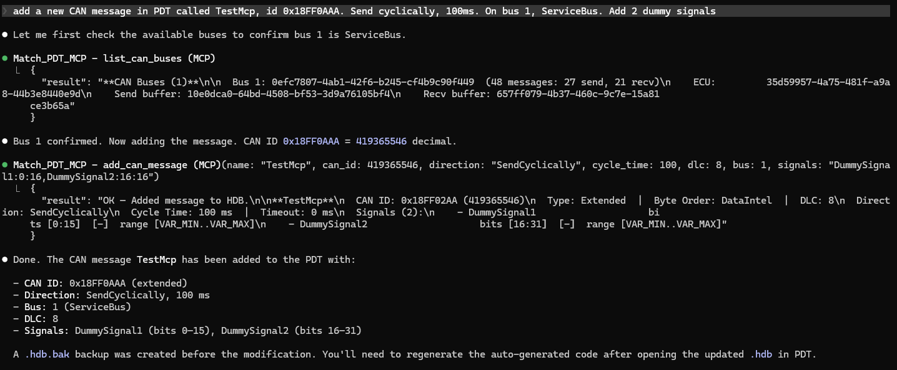
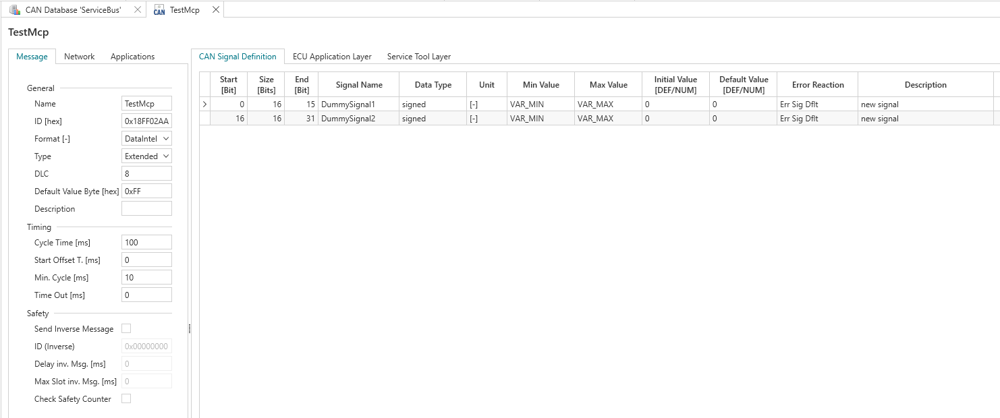

# MATCH PDT MCP Server

MCP server for HYDAC PDT `.hdb` project files. Queries and modifies CAN messages, signals, error definitions, and ECU configuration.

## How it works

An `.hdb` file is a ZIP archive containing XML configuration files and binary `.dat` files. The server:

1. Parses XML files (strips null padding) into indexed lookup dicts
2. Deserializes `.dat` files via a .NET helper using the PDT assemblies
3. Serves read/write queries via MCP stdio transport (lazy-loaded, cached)
4. For writes: creates `.hdb.bak` backup, modifies XML in-place, rewrites ZIP

## Why use this instead of reading generated code?

The PDT generates C code in `AUTO_CEN_*` folders — structs, enums, config arrays. For **CAN messages, signals, and error definitions**, the MCP server is faster and more convenient. For other areas (pins, blocks), the generated code remains the better source.

**What this does well:**
- **CAN signal lookup** — scaling formula, bit position, units, and parent message in one query. In generated code this is scattered across `App_CanSigRec.c`, `Cfg_CRcv.c`, `Cfg_CSnd.c`.
- **Signal search** — find signals by name substring across all messages, optionally filtered by message.
- **Message details** — CAN ID, DLC, cycle time, direction, and all signals linked together. In generated code you'd cross-reference multiple files.
- **Error definitions** — SPN, description, severity, debounce times, and thresholds. In generated code this is split between `App_ErrDefine.h` and `Cfg_Err.c` without the PDT metadata.
- **XML modification** — edit CAN messages, signals, databases, and other XML-based config directly.
- **Always current** — reads the `.hdb` directly, so it reflects the latest PDT save even if code hasn't been regenerated yet.

**What still requires generated code:**
- Pin configurations (`project.dat` uses complex .NET types that can't be loaded outside .NET Framework 4.8)
- Software blocks and detailed parameter entries within databases

**What can also be modified (binary .dat — via .NET helper):**
- Database variables in `project.dat` — add, update, delete parameters across NvMem/RAM databases
- Custom error definitions — add custom errors with error templates, detection methods, and ERR TBlocks (modifies both `project.dat` and `Errors.dat` atomically)

**What cannot be modified:**
- ISOBUS config (`Isobus.dat`)

## Installation

### Prerequisites

**Required:**
- Python 3.10+ with `mcp` package

**Optional (for .dat file tools):**
- .NET SDK 8.0+ (builds the helper targeting .NET Framework 4.8)
- HYDAC PDT installed (provides the .NET assemblies for `.dat` deserialization)

Without .NET SDK, all tools work except `list_errors` and `get_error` — they return an error message instead of crashing the server.

```bash
pip install "mcp[cli]"
```

### Build the .NET helper (optional)

Skip this step if you don't need error definition tools (`list_errors`, `get_error`).

```bash
cd Match_PDT_MCP/dotnet-helper
dotnet build -c Release
```

### Register with Claude Code (per project)

Add a `.mcp.json` file in the project root directory:

```json
{
  "mcpServers": {
    "Match_PDT_MCP": {
      "type": "stdio",
      "command": "python",
      "args": [
        "C:/Match/Tools/MCP/Match_PDT_MCP/server.py"
      ]
    }
  }
}
```

The server auto-discovers:
- **HDB_PATH** — first `*.hdb` file in the working directory
- **PDT_DIR** — matched to the project's PDT version (from `info.xml`), falling back to the latest installed version in `C:\Program Files\Hydac\Project Definition Tool\`

If the project has multiple `.hdb` files or a non-standard location, set environment variables explicitly:

```json
{
  "mcpServers": {
    "Match_PDT_MCP": {
      "type": "stdio",
      "command": "python",
      "args": ["C:/Match/Tools/MCP/Match_PDT_MCP/server.py"],
      "env": {
        "HDB_PATH": "C:/Match/Projects/MyProject/SpecificFile.hdb",
        "PDT_DIR": "C:/Program Files/Hydac/Project Definition Tool/2.12.100"
      }
    }
  }
}
```

The same `.mcp.json` works for any MATCH project — just drop it in the project root and Claude Code will start the server automatically.

## Available Tools

### CAN Read Tools (from XML)

| Tool | Parameters | Description |
|------|-----------|-------------|
| `list_can_buses` | *(none)* | List all CAN buses with message counts, ECU IDs, and send/receive buffer IDs. Use the bus number with other tools. |
| `get_can_message` | `name: str`, `can_id: int` | Look up message by name (case-insensitive, substring match) or CAN ID (decimal). Returns details + all signals + direction. |
| `list_can_messages` | `direction: str`, `name_filter: str`, `bus: int` | List all messages. Filter by direction (`send`/`receive`), name substring, or bus number. |
| `get_can_signal` | `name: str`, `message: str` | Look up signal by name (case-insensitive). Returns scaling, bits, units, parent message. Use `message` to disambiguate duplicates. |
| `search_can_signals` | `query: str`, `message: str` | Search signals by name substring. Optionally restrict to signals in a specific message. |

### CAN Write Tools

| Tool | Parameters | Description |
|------|-----------|-------------|
| `add_can_message` | `name`, `can_id`, `direction`, `dlc`, `cycle_time`, `signals`, `bus` | Add a complete CAN message with signals to a specific bus. Creates entries in `CanMessages.xml`, `CanMessageEcuLinks.xml`, and `CanSignals.xml`. Creates `.hdb.bak` backup before the first write. |

**`add_can_message` details:**
- `name` (required): Message name, e.g. `"VcuSendTestData"`
- `can_id` (required): CAN ID as decimal. Extended frame if > 0x7FF
- `direction`: `"SendCyclically"` (default), `"SendEventBased"`, or `"Receive"`
- `dlc`: Data Length Code, 0-8 (default 8)
- `cycle_time`: Cycle time in ms (default 100)
- `signals`: Comma-separated signal definitions as `name:startbit:sizebits`
- `bus`: Bus number, 1-indexed (default 1). Use `list_can_buses` to see available buses

Bus IDs, ECU IDs, and send/receive buffer IDs are discovered dynamically from the HDB — no hardcoded project-specific constants. This means the server works with any MATCH project, including multi-bus projects.

**Example:**
```
add_can_message(
    name="VcuSendTestData",
    can_id=419365500,
    direction="SendCyclically",
    dlc=8,
    cycle_time=100,
    signals="testValue:0:16,status:16:8,mode:24:4",
    bus=1
)
```

This creates:
- The message definition (CAN ID 0x18FF017C, Extended, Intel byte order) on bus 1
- ECU link with the correct send buffer for that bus
- 3 signals: `testValue` (16-bit at bit 0), `status` (8-bit at bit 16), `mode` (4-bit at bit 24)

**Visual walkthrough:**

Adding a CAN message from Claude Code:



The resulting message in the PDT:



### Database & ECU Tools (from XML + .dat via .NET helper)

| Tool | Parameters | Description |
|------|-----------|-------------|
| `list_databases` | *(none)* | List NvMem/RAM parameter databases with addresses and settings. |
| `list_db_variables` | `database: str` | List all variables in a database (or all databases if empty) with type, default, range, unit. |
| `get_db_variable` | `database: str`, `variable: str` | Get detailed info for a single variable including access levels and dataset values. |
| `add_db_variable` | `database`, `name`, `type`, `default`, `min`, `max`, `unit`, `description` | Add a new variable to a database. Clones from an existing variable of the same type. Creates `.hdb.bak` backup. |
| `update_db_variable` | `database`, `variable`, `default`, `min`, `max`, `unit`, `description` | Update properties of an existing variable. Only provided fields are changed. |
| `delete_db_variable` | `database: str`, `variable: str` | Remove a variable from a database. |
| `get_ecu_config` | *(none)* | ECU app config: cycle time, watchdog, protocols, protocol parameters, project info. |

### Error Tools (from .dat via .NET helper — requires .NET SDK 8.0+ and HYDAC PDT)

These tools are optional. Without .NET SDK, they return an error message; all other tools remain functional.

| Tool | Parameters | Description |
|------|-----------|-------------|
| `list_errors` | `spn_filter: int`, `description_filter: str` | List error definitions with SPN, description, severity, debounce, thresholds. |
| `get_error` | `spn: int` | Look up a specific error by SPN number. Returns full details. |
| `list_error_templates` | *(none)* | List custom error block templates. |
| `list_detection_methods` | `filter: str` | List detection methods with bit positions and FMI values. |
| `list_fmi_definitions` | *(none)* | List FMI and FMI extension definitions with GUIDs. |
| `add_custom_error` | `template`, `dm_name`, `bit`, `spn`, `block_name`, `description`, `severity`, `fmi`, `fmi_extended`, debounce/threshold params | Add a custom error with detection method, error template, and ERR TBlock. Works on projects with or without existing custom errors. |

**`add_custom_error` details:**

Creates a complete custom error entry in the PDT project (atomic operation — modifies both `project.dat` and `Errors.dat`). Creates `.hdb.bak` backup before the first write.

- `template` (required): Error template/block name, e.g. `"Error index us"`. Creates a new template if not found.
- `dm_name` (required): Detection method name, e.g. `"DM_US_HINDEX_EOB"`. Must be unique.
- `bit` (required): Bit position within the block (0-7).
- `spn` (required): SPN number. Must be unique across all errors.
- `block_name`: Software error block name, e.g. `"ERR_INDEX_US"`. Required when creating a new template. Used as the TBlock name for code generation.
- `description`: Error description text.
- `severity`: 1=info, 3=warning (default), 5=critical.
- `fmi`: FMI name, default `"FMI_31_CONDITION_EXISTS"`.
- `fmi_extended`: FMI extension, default `"FMIEX_GLOBAL"`.
- Debounce/threshold: `set_debounce_ms` (500), `release_debounce_ms` (0), `set_threshold` (500), `release_threshold` (1000).

**What gets created:**
1. **Error template** in `Custom.ErrorTemplates` (if new)
2. **Detection method entries** in `Custom.DetectionMethods` and the template's `Error` list
3. **Error entry** in `Errors.dat` with SPN, severity, FMI, debounce settings
4. **ERR TBlock** with 8 detection method slots (bits 0-7), block parameters (SW_MODULE, BLOCK_NAME, ERROR_COUNT), and the Standard library ERR blueprint
5. **Template-to-TBlock link** via `LinkedBlockIds`

When the project has no existing ERR blocks, the tool auto-discovers a sibling project with ERR blocks (in `C:\Match\Projects\`) and clones the block structure from there, including TBlockParamSections and TDetectionMethods.

**Example:**
```
add_custom_error(
    template="Error test dummy",
    dm_name="DM_TEST_DUMMY_ALARM",
    bit=0,
    spn=2000,
    block_name="ERR_TEST_DUMMY",
    description="Dummy test alarm for validation",
    severity=3
)
```

### XML Write Tools

| Tool | Parameters | Description |
|------|-----------|-------------|
| `list_hdb_xml_files` | *(none)* | List all XML files in the HDB archive with sizes. |
| `read_hdb_xml` | `file: str`, `xpath: str` | Read raw XML content, optionally filtered by XPath. |
| `update_hdb_xml` | `file`, `xpath`, `action`, `tag`, `text`, `attributes` | Modify XML elements: `set_text`, `set_attr`, `add_child`, `remove`. Creates `.hdb.bak` backup. |

### Utility Tools

| Tool | Parameters | Description |
|------|-----------|-------------|
| `search_hdb` | `pattern: str` | Regex search across all XML content in the HDB archive (max 100 results). |
| `reload_hdb` | *(none)* | Force re-parse of all data after saving in PDT. |

## HDB Archive Structure

### XML Files (read/write via Python)

| File | Content |
|------|---------|
| `CanMessages.xml` | CAN message definitions (ID, DLC, cycle time, byte order) |
| `CanSignals.xml` | Signal definitions (bit position, scaling, units, min/max) |
| `CanMessageEcuLinks.xml` | Send/receive direction, ECU assignment, and buffer block per message (used for dynamic bus discovery) |
| `DatabaseLists.xml` | NvMem/RAM database layouts |
| `EcuApplications.xml` | ECU config (cycle time, watchdog) |
| `Protocols.xml` | Protocol instances (MST, ISO-Bus) |
| `ProtocolParameters.xml` | Protocol settings (source addresses, buffer config) |
| `PinEcuApplicationLinks.xml` | I/O pin mappings (GUIDs only) |
| `info.xml` | PDT version and file format |

### Binary .dat Files (via .NET helper)

| File | Status | Content |
|------|--------|---------|
| `Errors.dat` | Read + write | Error definitions (SPN, severity, thresholds, reactions). Custom errors can be added via `add_custom_error`. |
| `CompileConfig.dat` | Curated read | Build mode, log level, flags |
| `Isobus.dat` | Curated read | ISOBUS configuration |
| `project.dat` | Read + write | Main project data (pins, blocks, FMI definitions). Database variables are read/write. |
| All .dat files | Generic dump | Full JSON dump via `dump` / `dump-all` commands |

### HDB Diff Tool

Compare two `.hdb` files semantically:

```bash
python hdb_diff.py <hdb_a> <hdb_b> [--output report.md]
```

Compares all XML files (element-level by ID/Name) and all .dat files (JSON deep-diff). Outputs a markdown report showing added/removed/changed elements.

## Limitations

- **Most `.dat` files are read-only** — `project.dat` (database variables, custom errors/templates) and `Errors.dat` (error entries) support write-back. The generic `dump` command can read all .dat files to JSON for diffing.
- **PDT version matching** — the server auto-matches the PDT installation to the project's version (from `info.xml`). If the exact version is not installed, it falls back to the latest available and logs a warning.
- **ERR block cloning** — when adding custom errors to a project without existing ERR blocks, the tool searches sibling projects for an ERR block to clone structure from. If no reference project is found, the error template and detection method are still created, but without a TBlock.
- **Pin name resolution** requires cross-referencing GUIDs through `project.dat`. The `dump project.dat` command now exposes pin data.
- **Error GUID fields** (Fmi, DetectionMethod, MachineFunction, RestrictedMode) reference objects in `project.dat` and can't be resolved to names.
- **Signal name duplicates** — many signals share the same name across different messages. Use the `message` parameter in `get_can_signal` to disambiguate.

## Dependencies

**Required:**
- Python 3.10+
- `mcp` package (`pip install "mcp[cli]"`)

**Optional (for .dat file tools and diff):**
- .NET SDK 8.0+ (to build the helper)
- HYDAC PDT installation (provides the .NET assemblies for deserialization)

## Disclaimers

This project is not associated with or endorsed by HYDAC International GmbH in any way.

This software was not created to compete with the HYDAC Project Definition Tool (PDT) or any other commercial software. It is a utility to help developers working with MATCH controllers interact with their project files programmatically.

HYDAC PDT installation is required for .dat file functionality — this project does not include or redistribute any HYDAC proprietary files.
